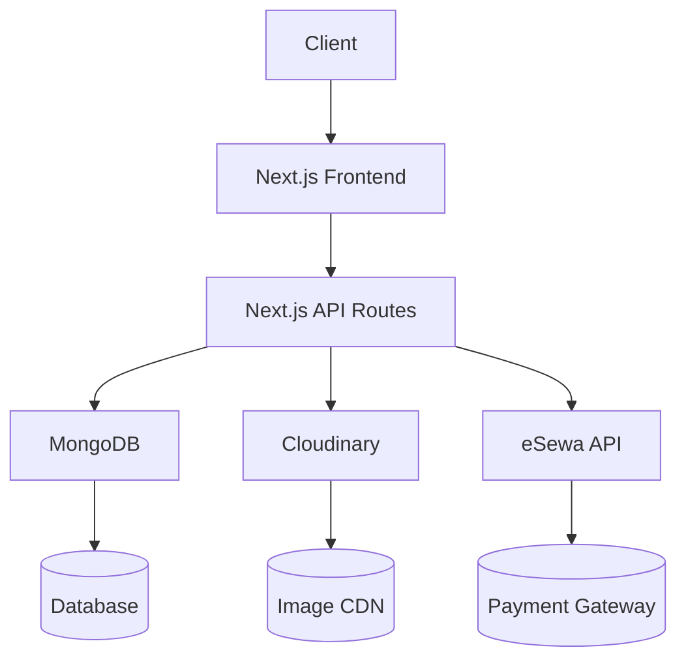

# Maa Kali Hardware - Enterprise CMS Solution


_A complete Content Management System for hardware e-commerce with blog capabilities_

## Table of Contents

- [Project Overview](#-project-overview)
- [Key Features](#-key-features)
- [Getting Started](#-getting-started)
  - [Prerequisites](#prerequisites)
  - [Installation](#installation)
  - [Environment Setup](#environment-setup)
  - [Running the Application](#running-the-application)
- [Project Structure](#-project-structure)
- [API Documentation](#-api-documentation)

## Project Overview

Maa Kali Hardware CMS is a full-featured content management system designed for hardware e-commerce businesses with:

- **Admin Dashboard**: Complete CRUD operations for products, blogs, and customer messages
- **Secure Authentication**: JWT with access/refresh token implementation
- **E-commerce Features**: Online payment processing via eSewa
- **Media Management**: Cloudinary integration for image uploads and delivery
- **Scalable Architecture**: Modular codebase designed for future expansion

## Key Features

### Core Functionality

- **Multi-model CRUD Operations**
  - Product catalog management
  - Blog content system
  - Customer message handling
- **Role-based Access Control**
  - Admin privileges
  - Editor permissions
  - Viewer access

### Advanced Capabilities

- **JWT Authentication System**
  - Access token (short-lived)
  - Refresh token (long-lived)
  - Automatic token rotation
- **Payment Gateway Integration**
  - eSewa payment processing
  - Transaction history
  - Payment verification
- **Performance Optimizations**
  - Tanstack Query for efficient data fetching
  - Zustand for lightweight state management
  - Image optimization via Cloudinary

## Getting Started

### Prerequisites

- **MONGO DB SETUP & URI in the env field**
- **Setup Cloudinary**
- **All the required fields to be filled in the env file**

### installation

- Clone Repository or download zip file

```bash
git clone https://github.com/AmanDhungel/MaaKali.git
```

- Install all the dependencies

```bash
npm i
```

- Run the Application

```bash
npm run dev
```

### Env Setup

-MONGO_URI= YOUR_MONGO_URI
-NEXT_ACCESS_TOKEN_SECRET=YOUR_ACCESS_TOKEN_SECRET
-NEXT_REFRESH_TOKEN_SECRET=YOUR_REFRESH_TOKEN_SECRET
-NEXT_PUBLIC_CLOUDINARY_CLOUD_NAME=YOUR_PUBLIC_CLOUDINARY_CLOUD_NAME
-NEXT_PUBLIC_CLOUDINARY_API_KEY=YOUR_CLOUDINARY_API_KEY
-CLOUDINARY_API_SECRET=YOUR_CLOUDINARY_API_SECRET

### Run the Application

```bash
npm run dev
```

## Technology Stack

### Frontend

| Technology     | Purpose           | Version |
| -------------- | ----------------- | ------- |
| Next.js        | React framework   | 13.4+   |
| TypeScript     | Type safety       | 4.9+    |
| Tailwind CSS   | Utility-first CSS | 3.3+    |
| Zustand        | State management  | 4.0+    |
| Tanstack Query | Data fetching     | 4.0+    |

### Backend

| Technology     | Purpose              | Version |
| -------------- | -------------------- | ------- |
| Next.js API    | Serverless functions | 13.4+   |
| MongoDB        | Database             | 5.0+    |
| Mongoose       | ODM for MongoDB      | 7.0+    |
| Cloudinary SDK | Image management     | 1.0+    |

### DevOps

| Technology | Purpose         |
| ---------- | --------------- |
| Prettier   | Code formatting |

## System Architecture



# Database

MONGO_URI=mongodb+srv://<username>:<password>@cluster.mongodb.net/reponame?retryWrites=true&w=majority

# Authentication

NEXT_ACCESS_TOKEN_SECRET=your_strong_access_token_secret_here
NEXT_REFRESH_TOKEN_SECRET=your_strong_refresh_token_secret_here

# Cloudinary

NEXT_PUBLIC_CLOUDINARY_CLOUD_NAME=your_cloud_name
NEXT_PUBLIC_CLOUDINARY_API_KEY=your_api_key
CLOUDINARY_API_SECRET=your_api_secret

# eSewa (optional)

NEXT_PUBLIC_ESEWA_MERCHANT_ID=your_merchant_id
ESEWA_SECRET_KEY=your_secret_key

## Key Features

### Content Management System

- **Blog Management**

  - Create, Read, Update, Delete blog posts
  - Rich text editor with image embedding
  - Category and tag organization
  - Scheduled publishing

- **Product Management**

  - Full product CRUD operations
  - Inventory tracking system
  - Multiple product variants (size/color)
  - Pricing and discount management

- **Customer Messages**
  - Incoming message dashboard
  - Status tracking (New/In Progress/Resolved)
  - Admin response system
  - Message archiving

### E-Commerce Functionality

- **Shopping Cart System**

  - Persistent cart across sessions
  - Guest checkout option
  - Cart item quantity adjustment
  - Real-time price calculation

- **Order Processing**
  - Secure checkout flow
  - Order confirmation emails
  - Order status tracking
  - Purchase history for users

### Client Communication

- **Contact System**

  - Customer-facing contact form
  - Automated receipt confirmation
  - File attachment support
  - Spam protection

- **Admin Tools**
  - Unified message center
  - Bulk action support
  - Customer communication history
  - Export message data

### Security Features

- JWT authentication for all CRUD operations
- Role-based access control
- CSRF protection
- Data validation on all endpoints

### Performance Optimizations

- Image optimization via Cloudinary CDN
- Tanstack Query for efficient data fetching
- Zustand for lightweight state management
- Code-splitting for faster page loads

## API Documentation

### Authentication

**Data** `/api/login`

```json
{
  "email": "user@example.com",
  "password": "securePassword123"
}

{
  "user": {
    "_id": "user123",
    "username": "admin",
    "email": "admin@maakali.com",
    "image": "https://cloudinary.com/user123.jpg"
  },
  "accessToken": "eyJhbGciOi...",
  "refreshToken": "eyJhbGciOi..."
}
```

**Data** `/api/blog`

```json
{
  "title": "New Hardware Tools",
  "excerpt": "Discover our latest tools...",
  "description": "Full article content...",
  "author": "Admin User",
  "tags": ["tools", "hardware"],
  "image": "cloudinary_image_id",
  "relatedPosts": ["blog123", "blog456"]
}

{
  "_id": "blog789",
  "title": "New Hardware Tools",
  "comments": [],
  "createdAt": "2023-08-20T12:00:00Z"
}
```

**Data** `/api/blog/:id`

```json
{
"_id": "blog789",
"title": "New Hardware Tools",
"excerpt": "Discover our latest tools...",
"description": "Full article content...",
"comments": [
{
"name": "John Doe",
"email": "john@example.com",
"comment": "Great article!",
"date": "2023-08-21T10:00:00Z"
}
],
"relatedPosts": ["blog123", "blog456"]
}

{
"name": "Jane Smith",
"email": "jane@example.com",
"comment": "Very helpful!"
}
```

**Data** `/api/product`

```json
{
  "id": "prod789",
  "name": "Professional Hammer",
  "category": "Hand Tools",
  "brand": "Maa Kali",
  "price": 24.99,
  "originalPrice": 29.99,
  "rating": "4.8",
  "inStock": "true",
  "isProductNew": "true",
  "features": ["Ergonomic handle", "Anti-slip grip"],
  "image": "cloudinary_image_id"
}

{
  "_id": "prod789",
  "name": "Professional Hammer",
  "price": 24.99
}
```

**Data** `/api/product/:id`

```json
{
  "_id": "prod789",
  "name": "Professional Hammer",
  "specifications": "Weight: 1.2kg, Material: Steel",
  "relatedProducts": "prod123,prod456"
}
```

**Data** `/api/contact`

```json
{
"name": "John Doe",
"email": "john@example.com",
"phonenumber": "+9779812345678",
"message": "Do you have bulk discounts?"
}

{
"_id": "contact123",
"checked": "false"
}
```

**Data** `/api/contact/:id`

```json
{
  "_id": "contact123",
  "checked": "true"
}
```

### Protected Routes

- path: ['/admin/:path*']
- this means routes that contains /admin will go throught middleware check and will be protected.

### Key improvements from your models:

1. Added comment functionality to blogs
2. Included product specifications and features
3. Added contact message status updates
4. Included user registration endpoint
5. Added proper image handling for all models
6. Included related products/posts relationships
